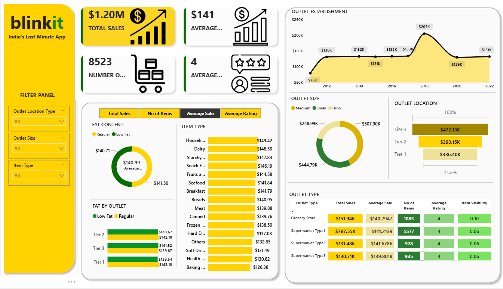

# Blinkit Grocery Sales Analytics Dashboard

An interactive Power BI dashboard for analyzing sales, outlet performance, item types, and customer ratings.

## Project Overview

This project provides a complete data-driven analysis of Blinkit (Grofers) grocery sales using an interactive Power BI dashboard. The dashboard uncovers insights across:

Total sales performance

Outlet-wise and item-wise comparisons

Customer rating trends

Fat content impact

Outlet size and establishment correlations

Product category performance

The dataset used for this project is available in the repository:
BlinkIT Grocery Data.xlsx

## Dashboard Preview

## Tools & Technologies

Power BI – Dashboard design & data visualization

Excel – Data preprocessing

DAX – Calculated measures

Data Modeling – Star schema for clean relationships

##  Key Insights
### Overall Metrics

Total Sales: $1.20M

Average Sales: $141

Total Items Sold: 8523

Average Rating: 4

## Item Type Performance

Top performing categories by average sales:

Household: $149.42

Dairy: $148.50

Starchy Foods: $147.84

Snacks: $146.19

Lowest performing:

Baking Goods: $126.38

Fat Content Analysis

## Average sales:

Low Fat: $140.99

Regular: $141.50

Fat content doesn’t significantly impact sales performance.

## Outlet Analysis
By Outlet Type
Outlet Type	Total Sales	Avg Sale	Items	Rating	Visibility
Grocery Store	151.94K	140.29	1083	4	0.10
Supermarket Type1	787.55K	141.21	5577	4	0.06
Supermarket Type2	131.48K	141.68	928	4	0.06
Supermarket Type3	130.71K	139.80	935	4	0.06

Supermarket Type1 is the top performer.

By Location Type

Tier 3: $472.13K

Tier 2: $393.15K

Tier 1: $336.40K

Tier-3 outlets significantly outperform others.

## Outlet Establishment Trend (2012–2022)

Sales peak in 2018 at $205K

Dip observed after 2019

Slight recovery by 2022

## Outlet Size

Medium-sized outlets have the highest contribution: $444.79K

📂 Project Structure
├── BlinkIT Grocery Data.xlsx
├── Dashboard Screenshot.png
└── README.md

